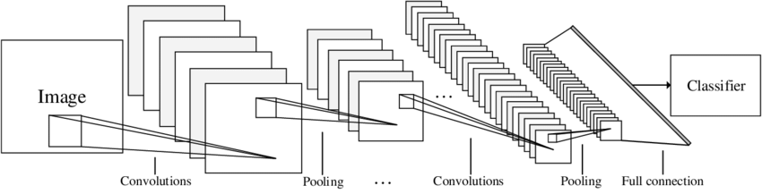
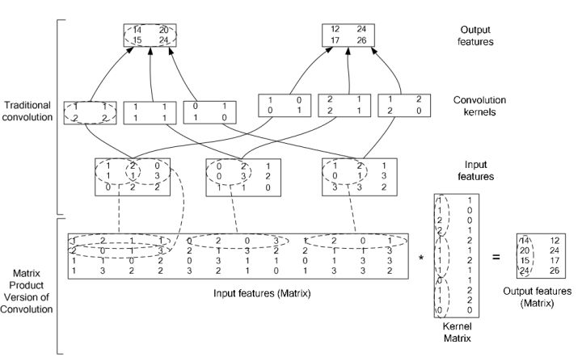

# numpy手写CNN分类MNIST数据集

## 网络设计
  
网络结构采用LeNet结构，如上图所示。  
+ 卷积层：conv1为16个5×5的卷积核，conv2为32个3×3的卷积核。激活函数为ReLU。
+ 池化层：采用最大池化，核的大小以及步长均设置为2。
+ 全连接层：输出形状为10，激活函数为softmax  

参数量：5×5×16+3×3×32+5×5×32×10 = 6516

## 训练和调试方法
+ numpy没有相应的卷积操作，所以使用如图所示的img2col方法，将其转换为矩阵相乘。  
  
+ 训练采用MiniBatch SGD, batchsize设置为64。
+ 一共训练20个epoch，前5个epoch学习率为：1e-5，第5到第10个epoch学习率为1e-6，第10到第20个epoch学习率为1e-7。  
+ 采用L2正则化，weight_decay设置为4e-4。
+ 采用MSRA初始化。

## 实验结果与分析比较
1. 采用上述网络训练，验证集正确率为0.98。
2. 将conv1和conv2的卷积核个数分别改为12和24，正确率为0.96。分析原因：卷积核数量和参数量减少使提取到的特征减少。
3. 去掉conv2和pool2，conv1卷积核大小设置为9×9，正确率为0.93。分析原因：网络层数减少使得网络无法提取更深层抽象的特征。

## 结论
网络的层数和参数量是两个对于网络性能影响很大的超参数。  
深层的网络能提取到抽象高级的特征，但同时也会使得训练困难。  
更大的参数量能够使网络学习到更多的特征，但也会消耗更多的计算资源或造成过拟合，降低网络的泛化能力。